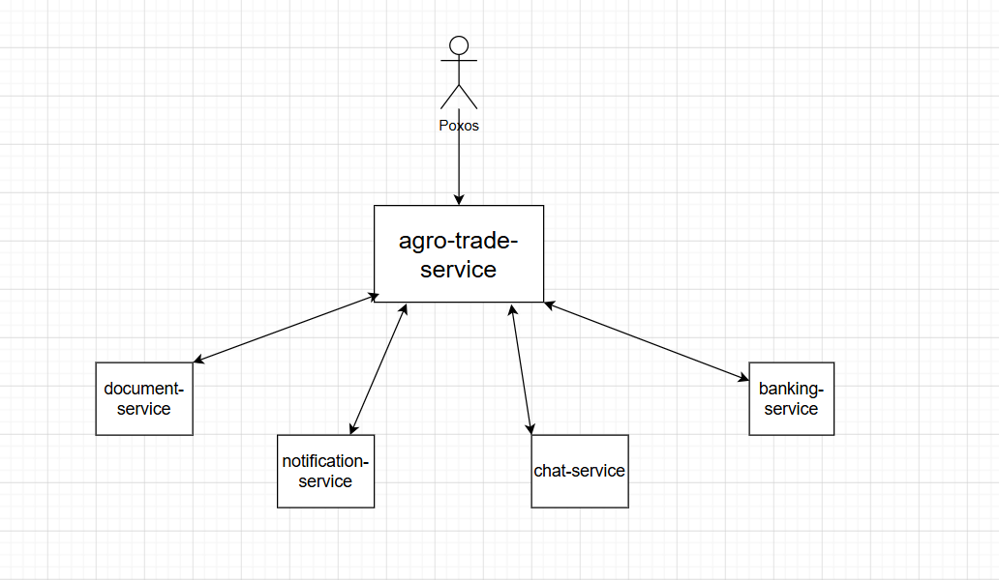

# 🌾 Agro Trade Service – API Documentation

This document describes the main **Agro Trade Service microservice** and its internal APIs, along with external integrations.

The system is built using a **microservice architecture**:

- 🌾 Agro Trade Service (Main Core Service)
- 📩 Notification Service
- 💬 Chat Service
- 🏦 Banking Service
- 📄 Document Service

---

# 🌐 Main Microservice (Agro Trade Service)

**Base URL**
/agro-trade-service/api/v1

## Overview

The Agro Trade Service is the **core backend service** of the system.  
It handles:

- User management
- Authentication & authorization
- Product management
- Orders
- Organizations
- News publishing
- Passport data

It acts as the **central business service** that connects all other microservices.

---

# 🔐 Auth API

**Base URL**
/agro-trade-service/api/v1/auth

### Register User
POST /register  
Creates a new user account and sends verification code.

---

### Verify User
POST /verify  
Verifies user account using verification code.

---

### Resend Code
POST /resend-code  
Resends verification code to user email.

---

### Login
POST /login  
Authenticates user and returns JWT tokens.

---

### Logout
POST /logout  
Invalidates current user session.

---

# 🔑 Token API

**Base URL**
/auth/token

### Refresh Token
POST /refresh  
Generates new access/refresh token pair.

---

# 👤 User API

**Base URL**
/agro-trade-service/api/v1/user

### Get Current User
GET /  
Returns authenticated user profile.

---

### Update User
PUT /  
Updates current user profile information.

---

### Change Password
PUT /change-password  
Changes user password.

---

# 📦 Product API

**Base URL**
/agro-trade-service/api/v1/products

### Get All Products
GET /  
Returns paginated list of products.

---

### Get My Products
GET /my  
Returns products created by authenticated seller.

---

### Get Product by ID
GET /{id}  
Returns product details.

---

### Create Product
POST /  
Creates a new product.

---

### Update Product
PUT /{id}  
Updates product data.

---

### Delete Product
DELETE /{id}  
Deletes product.

---

# 🪪 Passport API

**Base URL**
/agro-trade-service/api/v1/user/passport

### Get Passport
GET /  
Returns user passport data.

---

### Create Passport
POST /  
Creates passport record.

---

### Update Passport
PUT /  
Updates passport data.

---

### Delete Passport
DELETE /  
Deletes passport record.

---

# 🏢 Organization API

**Base URL**
/agro-trade-service/api/v1/user/organizations

### Get All Organizations
GET /  
Returns user organizations.

---

### Get Organization by ID
GET /{id}  
Returns organization details.

---

### Create Organization
POST /  
Creates new organization.

---

### Update Organization
PUT /{id}  
Updates organization data.

---

### Delete Organization
DELETE /{id}  
Deletes organization.

---

# 📦 Order API

**Base URL**
/agro-trade-service/api/v1/order

### Get All Orders
GET /  
Returns paginated orders list.

---

### Get My Orders
GET /my  
Returns orders of current manager.

---

### Get Order by ID
GET /{id}  
Returns order details.

---

### Create Order
POST /  
Creates a new order.

---

### Update Order Status
PUT /{id}  
Updates order status.

---

### Delete Order
DELETE /{id}  
Deletes order.

---

# 📰 News API

**Base URL**
/agro-trade-service/api/v1/news

### Get All News
GET /  
Returns paginated news list.

---

### Get My News
GET /my  
Returns news created by user.

---

### Get News by ID
GET /{id}  
Returns news details.

---

### Create News
POST /  
Creates news post.

---

### Update News
PUT /{id}  
Updates news post.

---

### Delete News
DELETE /{id}  
Deletes news post.

---

# 📩 External Microservices

## 📩 Notification Service

**Base URL**
/notification-service/api/v1/notifications

Used for:

- Email verification
- Password reset
- Welcome emails
- Order notifications
- Notification settings

### Endpoints:

- POST /send/verify → Send verification email
- POST /send/reset-password → Send reset password email
- POST /send/order-opened → Notify order creation
- POST /send/welcome → Send welcome email
- POST /settings/save → Save notification settings

---

## 💬 Chat Service

**Base URL**
/chat-service/api/v1/chats

Used for:

- Chat creation
- Messaging system
- Conversation history

### Endpoints:

- POST / → Create chat
- GET /{id} → Get chat details with messages

---

## 🏦 Banking Service

### Offers API
/banking-service/api/v1/offers

- GET / → Get active offers
- GET /{id} → Get offer by ID

### Contracts API
/banking-service/api/v1/contracts

- POST / → Create final contract
- GET /{id} → Get contract
- GET / → Get all contracts
- PUT /{id}/update → Update document status

---

## 📄 Document Service

**Base URL**
/document-service/api/v1/generate-document

Used for:

- Generating contract documents
- Generating order documents
- Exporting system-generated PDFs/contracts

### Endpoints:

### Generate Bank Contract Document
POST /contract  
Generates a bank contract document based on request data.

---

### Generate Order Document
POST /order  
Generates an order-related document (PDF/report).

---

# 🔐 Security

All APIs use JWT authentication:

Authorization: Bearer <token>

---

# 🧩 Architecture Overview

The system is built using microservices:

- 🌾 Agro Trade Service → Core business logic
- 📩 Notification Service → Email system
- 💬 Chat Service → Messaging system
- 🏦 Banking Service → Financial operations
- 📄 Document Service → PDF / contract generation

Communication is done via REST APIs with secure JWT authentication.

---

# 🏗️ System Architecture Diagram

